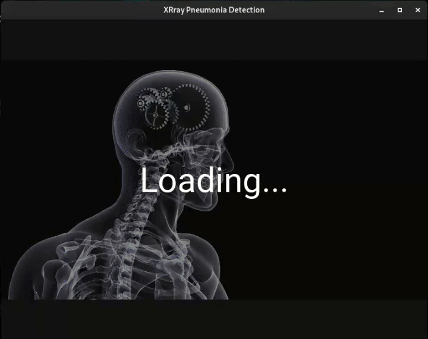
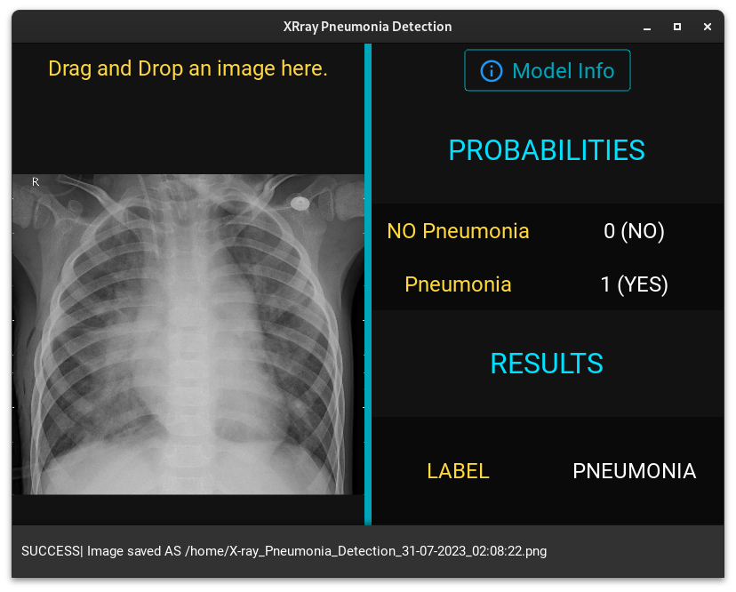
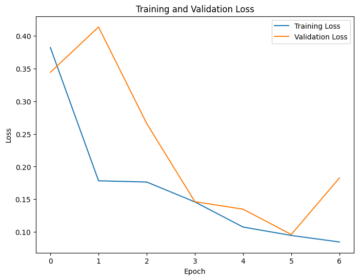
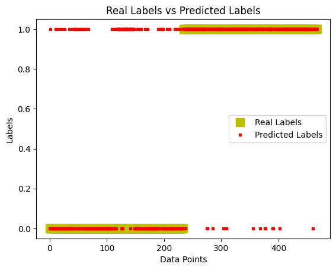

# :microscope: XRay-Pneumonia-Detection-GUI
### :warning: To download the model, please refer to the Usage Section for detailed instructions.


## Overview
**XRay-Pneumonia-Detection-GUI** is an deep learning project designed to automate pneumonia detection in X-ray images. By utilizing Convolutional Neural Networks (CNNs), this project classifies X-ray images into '**Normal**' and '**Pneumonia**' categories. The '**Pneumonia**' class includes both *bacterial* and *viral* pneumonia cases, making it a binary classification task. 

To enhance user experience and accessibility, a user-friendly **GUI** has been developed using `Python` and `Kivy`. This graphical interface empowers medical professionals to effortlessly upload X-ray images and obtain rapid and (often :smile:) reliable results, simplifying the pneumonia diagnosis process for you.


## :page_with_curl: Examples
Take a look at this GIF demonstration to get a brief overview of how to use the app:



It showcases the simple steps of dragging and dropping an image onto the window to analyze it for X-ray pneumonia detection. The user-friendly interface makes the process seamless and intuitive, providing quick results in just a few clicks!

---

Below are some screenshots from the app, giving you a glimpse of its user interface and functionality.

|       |           |
|-------|-----------|
|Loading Screen||
|Prediction |Prediction |
|Save path selection|Model Information |
|The exported image appears as follows: |


## :book: Dataset

For this project, I utilized a combination of two datasets:

1. Chest X-Ray Images (Pneumonia) from **Kaggle**: [Dataset Link](https://www.kaggle.com/datasets/paultimothymooney/chest-xray-pneumonia)

2. Curated Dataset for COVID-19 Posterior-Anterior Chest Radiography Images (X-Rays) from **Mendeley Data**: [Dataset Link](https://data.mendeley.com/datasets/9xkhgts2s6/4)

You can obtain my combined dataset by accessing the following link:
`https://drive.google.com/drive/folders/1T6-OsnuSFl3TwE5U-7u8cR1WRg9427M9?usp=sharing`

## :rocket: Model Description

---

:white_check_mark: Here, you'll find essential information. 

🔍 For a more detailed insight into the model and its performance, you can refer to the [notebook](./training.ipynb) itself. It contains comprehensive documentation and analysis of the model's architecture, training process, evaluation metrics, and visualization of results.

---

#### 1. Model Architecture

This model is a deep convolutional neural network (CNN) designed for classifying X-ray images into two classes: `NORMAL` and `PNEUMONIA`. The model architecture consists of several convolutional layers, followed by max-pooling layers to extract meaningful features from the input images. The key components of the model architecture are as follows:

1. **Input Layer**: The model takes grayscale X-ray images as input with a shape of (300, 400).

2. **Convolutional Layers**: The model contains multiple convolutional layers, each with a different number of filters and kernel sizes. The activation function used in the convolutional layers is ReLU (Rectified Linear Unit), which introduces non-linearity into the model.

3. **Max-Pooling Layers**: After each convolutional layer, there is a max-pooling layer that reduces the spatial dimensions of the feature maps, aiding in faster computation and reducing overfitting.

4. **Flatten Layer**: The final max-pooled output is flattened into a 1-dimensional vector to be fed into the dense layers.

5. **Dense Layers**: There are two dense layers in the model. The first dense layer consists of 512 neurons with a ReLU activation function, followed by another dense layer with 2 neurons using the softmax activation function. The final layer with 2 neurons produces the probability distribution for the two classes, "NORMAL" and "PNEUMONIA."


#### 2. Model Training

The model is trained using the available data split into training, testing, and validation sets. Data augmentation techniques, such as horizontal flipping, can be applied to the training data to increase the model's ability to generalize.


#### 3. Model Evaluation
The model's performance is evaluated on the training, testing, and validation datasets using the evaluation metrics of loss and accuracy. Additionally, a confusion matrix is constructed to visualize the model's predictions against the true labels of the test data.


The model's performance on the dataset is as follows:

```json
Train-loss:         0.13
Train-accuracy:     0.96

Test-loss:          0.74
Test-accuracy:      0.8

Val-loss:           0.13
Val-accuracy:       0.95
```
|       |           |
|-------|-----------|
|||
|||


Based on the observed graph and confusion matrix, the model exhibits superior performance in predicting the `PNEUMONIA` class (98.7%) compared to the `NORMAL` class (50%). However, it is important to note that the model's performance is subject to potential improvements in the future, and further optimization may lead to enhanced accuracy and generalization capabilities.

⚠️ Please be aware that we are currently working on this project, and there are plans to make further upgrades and improvements in the future.

## :link: Dependencies

To run this project, you need to have the following dependencies installed:

- 📦 [pip](https://pip.pypa.io/en/stable/): A package manager for installing Python libraries and packages.

- 🧠 [TensorFlow](https://www.tensorflow.org/): An open-source machine learning framework used for training the X-ray pneumonia classification model.

- 🔢 [NumPy](https://numpy.org/): A library for numerical computing in Python, used for handling arrays and data.

- 🖼️ [OpenCV](https://opencv.org/): A computer vision library used for image processing and analysis.

- 📈 [Matplotlib](https://matplotlib.org/): A plotting library for creating visualizations from data.

- 📱 [Kivy](https://kivy.org/): An open-source Python library for developing cross-platform GUI applications.


## :inbox_tray: Installation

##### Debian-based (e.g., Ubuntu, Debian):

```shell

sudo apt-get update
sudo apt-get install python3
sudo apt-get install python3-pip
pip3 install numpy
pip3 install matplotlib
pip3 install tensorflow
pip3 install opencv-python
pip3 install kivy

```

##### RPM-based (e.g., Fedora, CentOS, Red Hat Enterprise Linux):

```shell

sudo dnf update
sudo dnf install python3
sudo dnf install python3-pip
pip3 install numpy
pip3 install matplotlib
pip3 install tensorflow
pip3 install opencv-python
pip3 install kivy

```


##### Windows

1. **Python:**

    - Download the latest version of Python from the official website:
    https://www.python.org/downloads/

    - Run the installer, and make sure to check the option to add Python to PATH during installation.

2. **pip:**
    - By default, Python comes with pip installed. You can check it by opening the Command Prompt and running:
    ```cmd
        pip --version
    ```
3. **Modules:**
    ```shell
        pip3 install numpy
        pip3 install matplotlib
        pip3 install tensorflow
        pip3 install opencv-python
        pip3 install kivy
    ```

`After following these steps, simply copy the repository to your preferred directory.`

## :hammer_and_wrench: Usage
:stop_sign: Before using the model, you must download it using the following link and then extract it: 
`https://drive.google.com/drive/folders/1w2P1wKnjrXs57Wzv9Af8BEREdL3eTEui?usp=sharing`

:stop_sign: After extracting, you will find the "model-1" directory. To utilize the GUI app, simply move this directory to the "[assets](./XRay-Pneumonia-Detection-App/assets/)" folder within the app's directory "[XRay-Pneumonia-Detection-App/](./XRay-Pneumonia-Detection-App/)":

:white_check_mark: Congratulations, you are now all set to proceed!
> "model-1" -----> "XRay-Pneumonia-Detection-App/assets/"

If you want to use the ready-to-use application, follow these steps:
1. Copy the entire GitHub project to your local directory.
2. Navigate to the "XRay-Pneumonia-Detection-App" folder.
3. Run [main-GUI.py](./XRay-Pneumonia-Detection-App/main-GUI.py) to launch the user-friendly GUI application.

:white_check_mark: To utilize the program, wait for it to load completely, and then drag and drop your image onto the window. Upon doing so, you will observe the following interface:

---

However, if you are interested in training your own model using the provided notebook, you have the flexibility to make changes as per your specific requirements. 
For instance, you can modify the 
- dataset directory
- model structure
- loss function
- optimizer
- other details

1. Open the Jupyter notebook file named [training.ipynb](./training.ipynb) and navigate to the sections of interest, such as "`Data Preprocessing`", "`Model Architecture`", or "`Training Configuration`". 

2. Read the instructions and explanations provided in the notebook carefully.

3. Make sure you have the necessary datasets available or download dataset from the provided links in the [Dataset section](#book-dataset).

3. Feel free to experiment with different combinations and configurations to achieve the desired results. The notebook contains comments and code explanations to guide you through the impact of each modification. Once you are satisfied with the changes, sequentially run the modified cells to train and customize your own model.

5. Once the training is completed, you can save the trained model for future use.


## :art: Customization

#### Kivy configuration :wrench:

In the [XRay-Pneumonia-Detection-App/](./XRay-Pneumonia-Detection-App/) directory you will find a configuration file named [config.json](./XRay-Pneumonia-Detection-App/config.json) that allows you to customize the Kivy application with the following options:  


1. **Model Configuration:**
   - `"model_file_path"`: Path to the trained model file, which can be adjusted as per your specific model.
   - `"labels"`: List of labels used for classification, in this case, ["NORMAL", "PNEUMONIA"].

2. **Window Configuration:**
   - `"window_width"`: The width of the application window (default is 800 pixels).
   - `"window_height"`: The height of the application window (default is 600 pixels).
   - `"window_theme"`: The theme of the application window, either "Dark" or "Light".

3. **Other Configuration:**
   - `"trained_epochs"`: Number of epochs the model was trained for (default is 5).
   - `"trained_params"`: Number of trained parameters in the model (default is 17,167,106).

4. **Model Performance Metrics:**
   - `"train"`: Training performance metrics, including "loss" and "accuracy".
   - `"test"`: Testing performance metrics, including "loss" and "accuracy".
   - `"val"`: Validation performance metrics, including "loss" and "accuracy".

You can modify the values in the "config.json" file to suit your specific needs and preferences for the application.

Finally, your configuration file should ressemble the following structure: 

```json

{
    "model": {
        "model_file_path": "./assets/model-1",
        "labels": ["NORMAL", "PNEUMONIA"]
    },
    "window": {
        "window_width": 800,
        "window_height": 600,
        "window_theme": "Dark"
    },

    "other": {
        "trained_epochs": 5,
        "trained_params": 17167106
    },

    "train": {
        "loss": 0.13,
        "accuracy": 0.96
    },
    "test": {
        "loss": 0.74,
        "accuracy": 0.8
    },
    "val": {
        "loss": 0.13,
        "accuracy": 0.95
    }
}

```

#### Kivy assets :heavy_plus_sign:

Inside the [XRay-Pneumonia-Detection-App/](./XRay-Pneumonia-Detection-App/) directory,  there is an [assets](./XRay-Pneumonia-Detection-App/assets/) directory where you will store:

- The [design.kv](./XRay-Pneumonia-Detection-App/assets/design.kv) file for application's design
- The model file used to classify images
- A few images required for application, such as the [intro image](./XRay-Pneumonia-Detection-App/assets/intro-back.jpg).

:warning: The default model name is set to "model-1". If you decide to change it, remember to also update the "model_path" option in the [configuration file](./XRay-Pneumonia-Detection-App/config.json) accordingly.


## :page_with_curl: Code Description:

This is a Python script using the Kivy and KivyMD libraries to create a Graphical User Interface (GUI) for detecting pneumonia in X-ray images using a trained TensorFlow model. Let's go through the code and explain its functionality.

### Imports :package:

The script starts by importing the necessary modules from various libraries, including Kivy, KivyMD, and other standard Python modules like threading, json, os, etc.

### Load KV File :page_with_curl:

The `Builder.load_file()` command is used to load the Kivy Language file (KV) that defines the GUI layout and design.

### Configuration File :wrench:

The script uses a JSON configuration file (`config.json`) to set various parameters and paths for the application, such as the model file path, window size, window theme, etc. The `load_config()` method reads and extracts these values from the config file.

### Layout Classes :art:

The script defines three classes for different layouts (`DropFileLayout`, `LoadingLayout`, and `ModelInfoLayout`) used in the application. These classes define the structure of the GUI elements.

### Main Application Class - `PneumoniaDetectionApp` :computer:

The `PneumoniaDetectionApp` class is the main application class that inherits from `MDApp` (a class from KivyMD library for creating Material Design applications).

#### Initialization and Building :building_construction:

The `build()` method initializes and builds the main application. It sets the window theme based on the configuration file, shows the loading layout while the background loading takes place, and initializes the main layout (`DropFileLayout`).

#### Background Loading :hourglass_flowing_sand:

The `backgroundLoading()` method runs in the background to import necessary modules (cv2, numpy, tensorflow, matplotlib) and loads the trained TensorFlow model. Once the loading is complete, it schedules the main layout to be displayed using `Clock.schedule_once()`.

`Reason:` 

While starting the Kivy window, non-essential for initiating kivy window, second-degree modules will be loaded in the background, allowing the Loading Window to be displayed. Without this background loading, the Kivy window would be created, but its content would remain frozen and not properly visualized until all the required modules are imported.


#### Event Handling :raised_hand:

- The `on_file_selected()` method is called when an image is dropped onto the application. It updates the selected image and calls `analyzeImage()` to analyze the image using the loaded model.
- The `analyzeImage()` method preprocesses the selected image and feeds it to the model for classification. It then updates the GUI with the analysis results.
- The `btnModelInfo()` method shows the model information layout when the "Model Info" button is pressed.
- The `btnReturnMainWindow()` method returns to the main window from the model information layout.
- The `btnAnalyzeAgain()` method allows re-analyzing the same image after modifications.
- The `btnExportResults()` method exports the analyzed image with the classification results.

#### Image Exporting :floppy_disk:

The `exportPNG()` method draws text data on the analyzed image and exports it with the classification results.

### Entry Point :checkered_flag:

The `if __name__ == "__main__":` block is the entry point of the script. It creates an instance of `PneumoniaDetectionApp` and runs the Kivy application using `kivy_app.run()`.

### Additional Note :memo:

The script attempts to remove the exported image file (if any) after the Kivy application is closed.

## :raising_hand: Contributing
🙌 Contributions to this project are welcome! If you have any ideas, improvements, or bug fixes, please submit a pull request 🛠️. For major changes, please open an issue to discuss your ideas beforehand 💡.

## :scroll: License

This project is licensed under the MIT License 📜.


## :pray: Acknowledgments

- Special thanks to **Mendeley Data** and Kaggle for providing the datasets used in this project.
- Gratitude to **TensorFlow** and **NumPy** for their powerful capabilities in handling calculations and building neural networks.
- Appreciation to **OpenCV** for its invaluable contributions in image analysis.
- Many thanks to **Matplotlib** for enabling us to visualize the processed images effectively.
- Lastly, a shout-out to **Kivy** **Python** for providing the platform to create a user-friendly GUI for the application.
